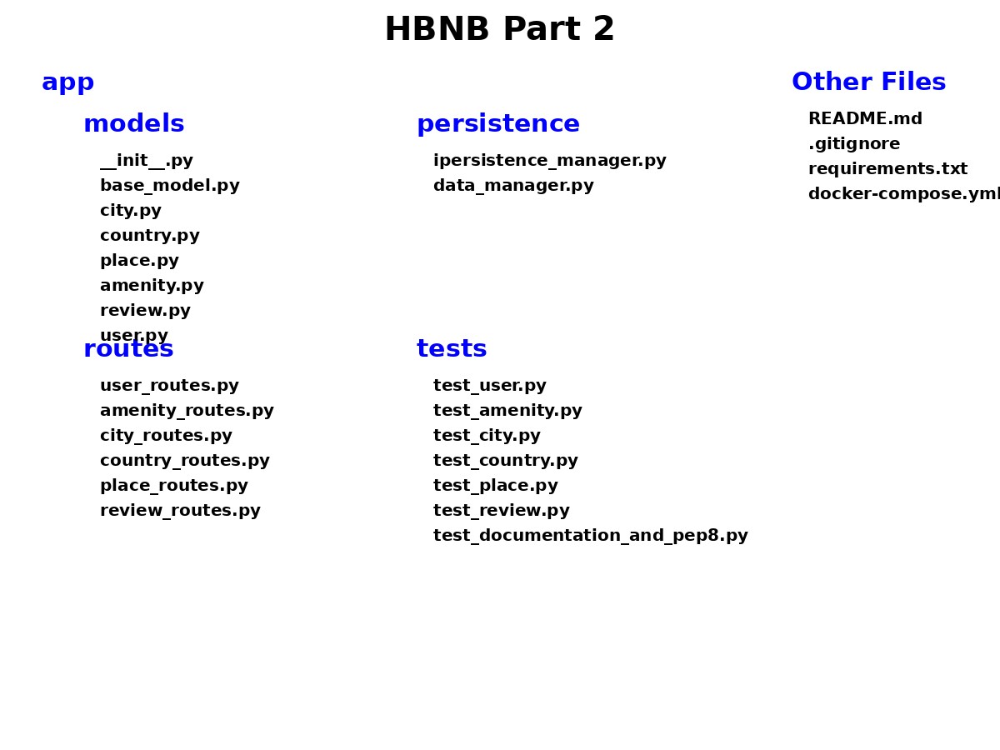

# HBNB Part 2

## Project Overview

This project is part of the Holberton BnB (HBnB) series, aiming to create a complete web application, integrating database storage, a back-end API, and front-end interfacing in a comprehensive manner. The project is divided into several parts, each building upon the previous to add more functionality and complexity.

## UML Diagram

The following UML diagram represents the structure of the project:




## Directory Structure and File Descriptions

### app
This directory contains the main application components.

- **models**
  - `__init__.py`: Initializes the models module and sets up any necessary configurations.
  - `base_model.py`: Defines the base class for all models, including common attributes and methods.
  - `city.py`: Defines the `City` class, representing a city with attributes such as name and state.
  - `country.py`: Defines the `Country` class, representing a country with relevant attributes.
  - `place.py`: Defines the `Place` class, representing a place or location.
  - `amenity.py`: Defines the `Amenity` class, representing amenities available at places.
  - `review.py`: Defines the `Review` class, for storing user reviews of places.
  - `user.py`: Defines the `User` class, representing users of the application.

- **persistence**
  - `ipersistence_manager.py`: Interface for persistence managers, defining methods for saving, deleting, and retrieving data.
  - `data_manager.py`: Implementation of the persistence manager, handling the actual data operations.

- **routes**
  - `user_routes.py`: Defines the routes related to user operations.
  - `amenity_routes.py`: Defines the routes related to amenity operations.
  - `city_routes.py`: Defines the routes related to city operations.
  - `country_routes.py`: Defines the routes related to country operations.
  - `place_routes.py`: Defines the routes related to place operations.
  - `review_routes.py`: Defines the routes related to review operations.

- **tests**
  - `test_user.py`: Contains unit tests for the `User` class.
  - `test_amenity.py`: Contains unit tests for the `Amenity` class.
  - `test_city.py`: Contains unit tests for the `City` class.
  - `test_country.py`: Contains unit tests for the `Country` class.
  - `test_place.py`: Contains unit tests for the `Place` class.
  - `test_review.py`: Contains unit tests for the `Review` class.
  - `test_documentation_and_pep8.py`: Tests for code documentation and PEP 8 compliance.

### Other Files
- `README.md`: Provides an overview and documentation for the project.
- `.gitignore`: Specifies files and directories to be ignored by Git.
- `requirements.txt`: Lists the dependencies required for the project.
- `docker-compose.yml`: Defines the Docker services, networks, and volumes for the project.

## Getting Started

To get started with this project, clone the repository and install the necessary dependencies:

```bash
git clone https://github.com/NadegeL/Hbnb-part-1.git
cd Hbnb-part-2
pip install -r requirements.txt

python manage.py run --host 0.0.0.0 --port 8080

### app
- **models**
  - __init__.py
  - base_model.py
  - city.py
  - country.py
  - place.py
  - amenity.py
  - review.py
  - user.py
- **persistence**
  - ipersistence_manager.py
  - data_manager.py
- **routes**
  - user_routes.py
  - amenity_routes.py
  - city_routes.py
  - country_routes.py
  - place_routes.py
  - review_routes.py
- **tests**
  - test_user.py
  - test_amenity.py
  - test_city.py
  - test_country.py
  - test_place.py
  - test_review.py
  - test_documentation_and_pep8.py

### Other Files
- README.md
- .gitignore
- requirements.txt
- docker-compose.yml


Hbnb-part-2/
├── images/
│   └── HBNB_Part2_UML.png
├── app/
│   ├── models/
│   ├── persistence/
│   ├── routes/
│   └── tests/
├── README.md
├── .gitignore
├── requirements.txt
└── docker-compose.yml

Authors:
Benjamin Jacob** (https://github.com/)
Jérôme Romand** (https://github.com/jeje-digifab)
Nadège Luthier** (https://github.com/)
Néia Santos Nascimento** (https://github.com/Neia2)

License
This project is licensed under the MIT License. See the LICENSE file for more details.